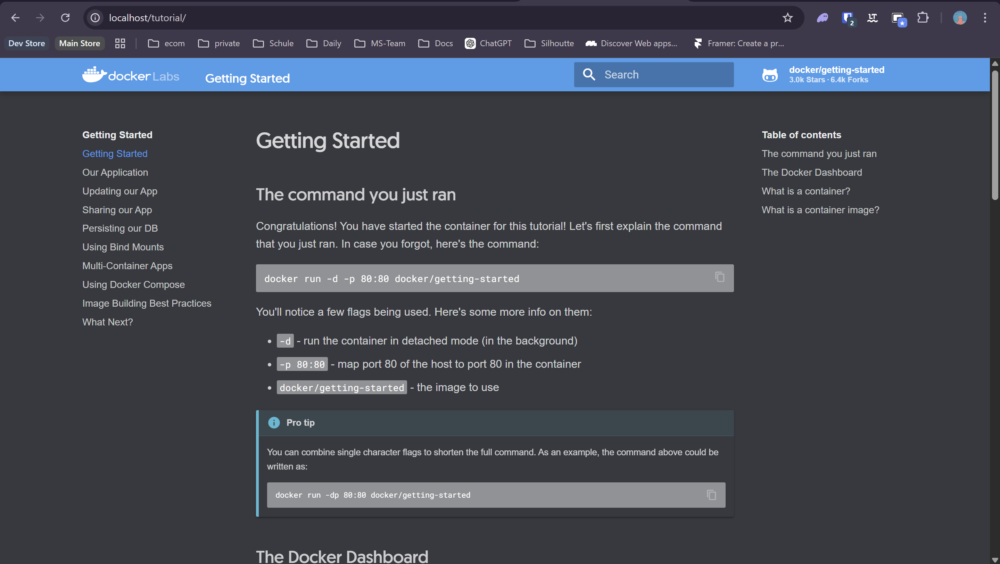
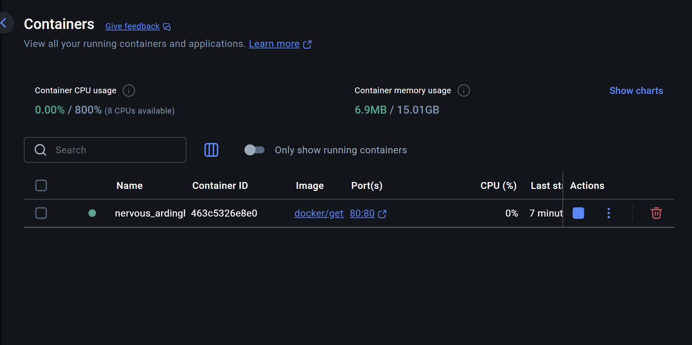
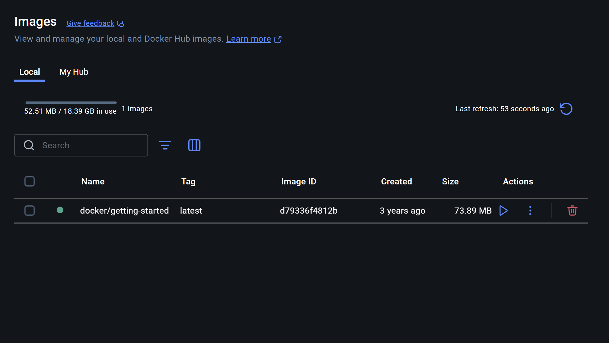
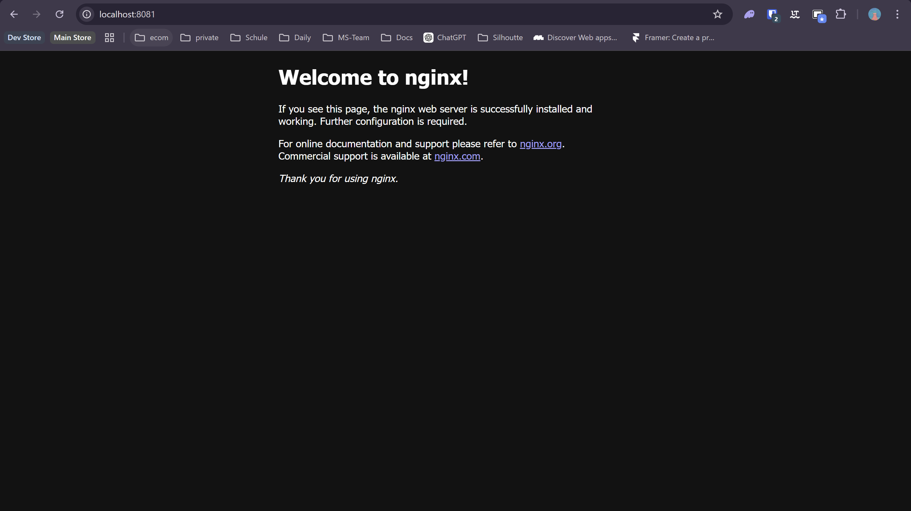
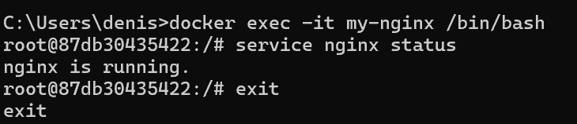
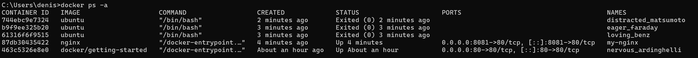
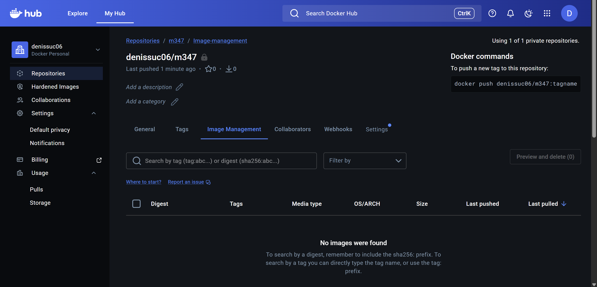
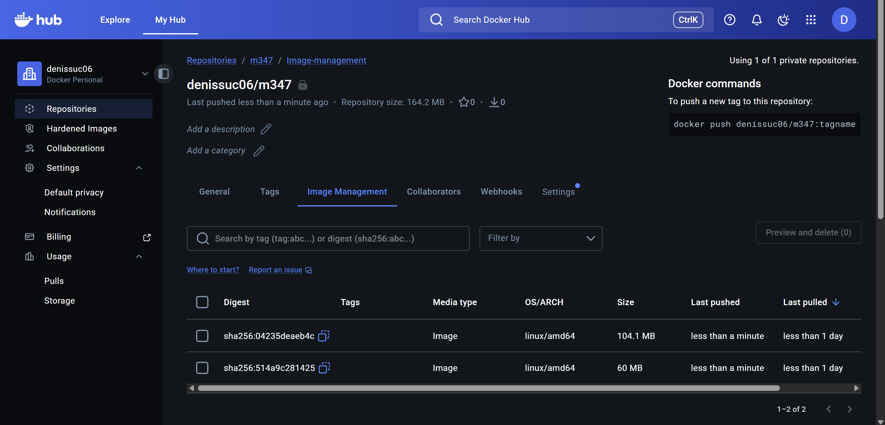

# KN01: Docker Grundlagen

## A) Installation

```bash
docker run -d -p 80:80 docker/getting-started
```





---

## B) Docker CLI

### 1. Docker-Version

```bash
docker version
```

### 2. Images suchen

```bash
docker search ubuntu
docker search nginx

output:
ubuntu/nginx                     Nginx, a high-performance reverse proxy & we…   138
```

### 3. Erklärung `docker run -d -p 80:80 docker/getting-started`

- `docker run` – Erstellt und startet einen Container aus einem Image.
- `-d` – Detached mode, Container läuft im Hintergrund.
- `-p 80:80` – Port-Mapping Host:Container. Dienst erreichbar unter `localhost:80`.
- `docker/getting-started` – Name des Images. Wird bei Bedarf automatisch von Docker Hub geladen.

### 4. nginx (pull, create, start)

```bash
docker pull nginx
docker create --name my-nginx -p 8081:80 nginx
docker start my-nginx
```

- `docker pull` lädt das Image herunter, ohne Container zu erstellen.
- `docker create` erstellt den Container (Port 8081→80), startet ihn aber nicht.
- `docker start` startet den erstellten Container.



### 5. ubuntu – Hintergrund vs. Interaktiv

```bash
docker run -d ubuntu
```

Das Image wird automatisch heruntergeladen. Der Container beendet sich aber sofort, weil Ubuntu keinen Dauerprozess hat. Im Detached-Modus gibt es keinen Vordergrund-Prozess, daher stoppt der Container direkt. Mit `docker ps -a` sieht man ihn im Status "Exited".

```bash
docker run -it ubuntu
```

Mit `-i` (interactive) und `-t` (TTY) öffnet sich eine Bash-Shell im Container. Man kann darin Befehle ausführen. Der Container bleibt aktiv, solange die Shell läuft. Mit `exit` wird er beendet.

### 6. Shell in laufendem Container

```bash
docker exec -it my-nginx /bin/bash
service nginx status
exit
```

`docker exec` öffnet eine zusätzliche Shell in einem **laufenden** Container. Nach `exit` läuft der Container weiter – nur die Shell-Session wird beendet.



### 7. Container-Status

```bash
docker ps -a
```



### 8–10. Aufräumen

```bash
docker stop my-nginx
# Entfernt alle gestoppten Container.

docker container prune

# Mit `docker rmi nginx ubuntu` werden die Images `nginx` und `ubuntu` vom lokalen System gelöscht (rmi = remove image).
docker rmi nginx ubuntu
```

---

## C) Registry und Repository

1. Account auf [Docker Hub](https://hub.docker.com/) mit GitHub erstellt.
2. Privates Repository `m347` erstellt.
3. Einloggen:

```bash
docker login
```



---

## D) Privates Repository

### Befehle

```bash
docker pull nginx
docker tag nginx:latest denissuc06/m347:nginx
docker push denissuc06/m347:nginx

docker pull mariadb
docker tag mariadb:latest denissuc06/m347:mariadb
docker push denissuc06/m347:mariadb
```

### Erklärungen

- `docker tag` erstellt eine neue Referenz (Alias) für ein bestehendes Image. Das Image wird nicht kopiert, nur ein zusätzlicher Verweis auf dieselben Layer erstellt.
- **Tag** = Label/Bezeichnung für eine bestimmte Version eines Images (z.B. `latest`, `1.25`). Ein Image kann mehrere Tags haben.
- `docker push` lädt das getaggte Image in das Remote-Repository auf Docker Hub hoch. Man muss dafür eingeloggt sein.


