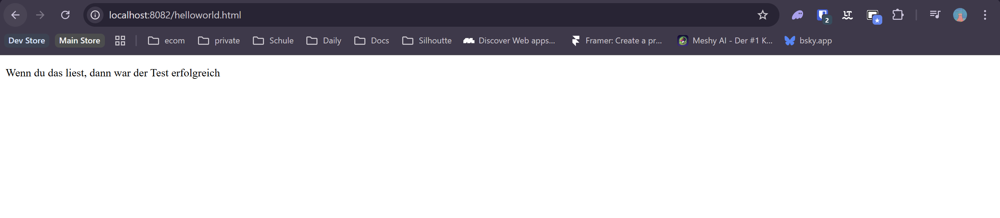
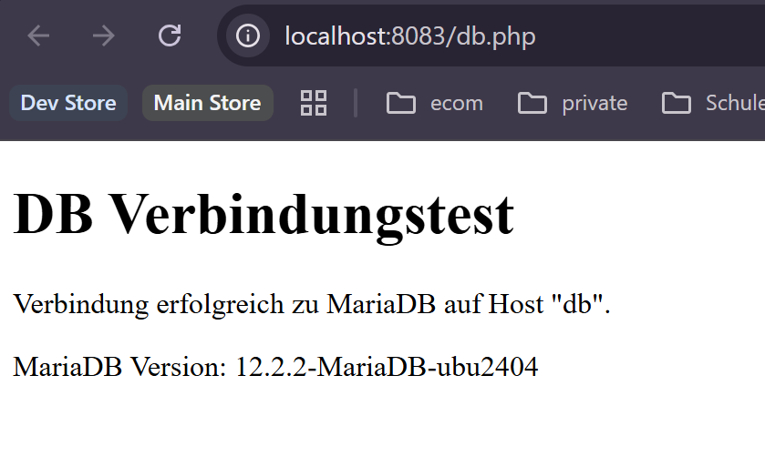
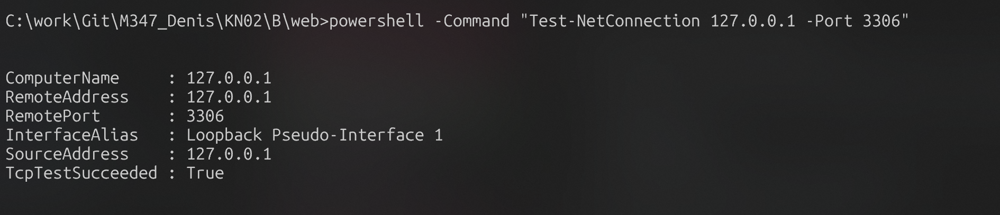
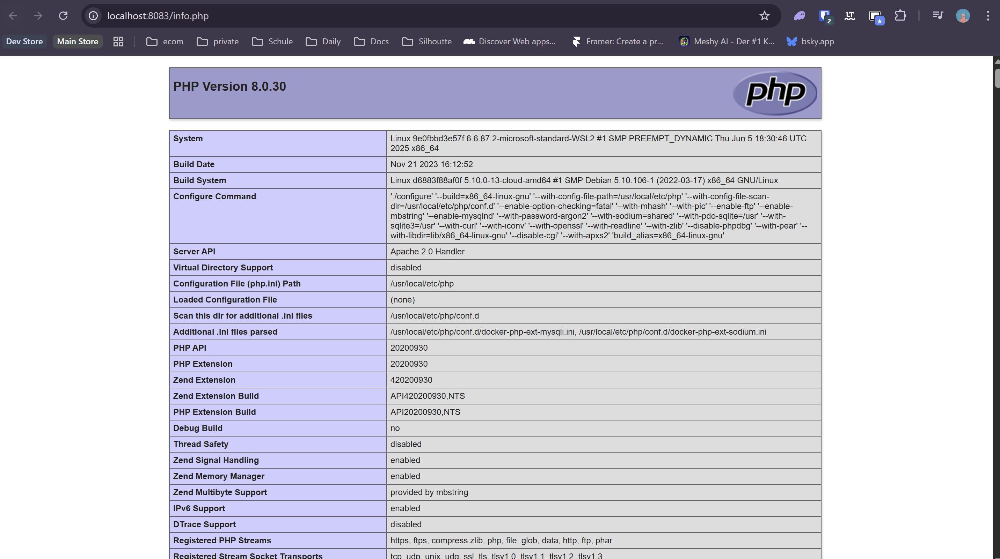
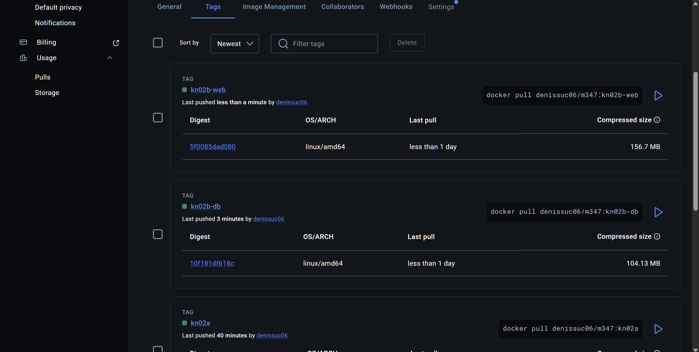

# KN02: Dockerfile

Docker-Hub Benutzer in den Befehlen: `denissuc06`  
Privates Repository: `denissuc06/m347`

---

## A) Dockerfile I

### 1) Vorgegebenes Dockerfile in eigenen Worten dokumentiert

```Dockerfile
FROM nginx
COPY static-html-directory /var/www/html
EXPOSE 80
```

- `FROM nginx`: Verwendet das oeffentliche nginx-Image als Basis fuer das neue Image.
- `COPY static-html-directory /var/www/html`: Kopiert lokale Dateien beim Build in das Dateisystem des Images.
- `EXPOSE 80`: Kennzeichnet Port 80 als vorgesehenen Port im Container (der Host-Port wird erst mit `-p` gemappt).

### 2) Umsetzung fuer KN02A mit `WORKDIR`

Die Webseiten im nginx-Image liegen unter `/usr/share/nginx/html`.  
Darum wurde `WORKDIR` gesetzt und in `COPY` kein absoluter Zielpfad mehr verwendet.

Datei `KN02/A/Dockerfile`:

```Dockerfile
FROM nginx:latest
WORKDIR /usr/share/nginx/html
COPY helloworld.html .
EXPOSE 80
```

Datei `KN02/A/helloworld.html`:

```html
<!DOCTYPE html>
<html>
    <head>
        <title>hello world</title>
    </head>
    <body>
        <p>Wenn du das liest, dann war der Test erfolgreich</p>
    </body>
</html>
```

### 3) Verwendete Docker-Befehle (Build, Push, Run)

Im Ordner `KN02/A`:

```bash
docker build -t denissuc06/m347:kn02a .
docker images
docker login
docker push denissuc06/m347:kn02a
```

Container starten:

```bash
docker run -d --name kn02a-web -p 8082:80 denissuc06/m347:kn02a
```

Falls der Name bereits existiert:

```bash
docker rm -f kn02a-web
docker run -d --name kn02a-web -p 8082:80 denissuc06/m347:kn02a
```

Kontrolle:

```bash
docker ps
```

Browser-Test:

```text
http://localhost:8082/helloworld.html
```

Screenshot:




---

## B) Dockerfile II

Ziel: Zwei Images/Container
- DB-Container auf Basis `mariadb`
- Web-Container auf Basis `php:8.0-apache`

### 1) DB-Image (`kn02b-db`)

Datei: `KN02/B/db/Dockerfile`

```Dockerfile
FROM mariadb:latest

ENV MYSQL_ROOT_PASSWORD=kn02rootpw
ENV MYSQL_DATABASE=m347

EXPOSE 3306
```

Build und Run:

```bash
# Im Ordner KN02/B/db ausfuehren
docker build -t denissuc06/m347:kn02b-db .
docker run -d --name kn02b-db -p 3306:3306 denissuc06/m347:kn02b-db
docker push denissuc06/m347:kn02b-db
```

Port-Test vom Host (Windows, ohne Telnet):

```bash
powershell -Command "Test-NetConnection 127.0.0.1 -Port 3306"
```

Erwartung: `TcpTestSucceeded : True`

### 2) Web-Image (`kn02b-web`)

Datei: `KN02/B/web/Dockerfile`

```Dockerfile
FROM php:8.0-apache

WORKDIR /var/www/html
COPY info.php db.php ./

RUN docker-php-ext-install mysqli

EXPOSE 80
```

Datei: `KN02/B/web/info.php`

```php
<?php
phpinfo();
```

Datei: `KN02/B/web/db.php`

```php
<?php
$dbHost = 'db';
$dbUser = 'root';
$dbPass = 'kn02rootpw';
$dbName = 'm347';

$conn = new mysqli($dbHost, $dbUser, $dbPass, $dbName);
?>
<!DOCTYPE html>
<html lang="de">
<head>
  <meta charset="UTF-8">
  <title>DB Verbindungstest</title>
</head>
<body>
  <h1>DB Verbindungstest</h1>
  <?php if ($conn->connect_error): ?>
    <p>Verbindung fehlgeschlagen: <?php echo htmlspecialchars($conn->connect_error); ?></p>
  <?php else: ?>
    <p>Verbindung erfolgreich zu MariaDB auf Host "<?php echo htmlspecialchars($dbHost); ?>".</p>
    <?php
    $result = $conn->query("SELECT VERSION() AS version");
    if ($result && $row = $result->fetch_assoc()) {
        echo '<p>MariaDB Version: ' . htmlspecialchars($row['version']) . '</p>';
    }
    ?>
  <?php endif; ?>
</body>
</html>
```

Build und Run:

```bash
# Im Ordner KN02/B/web ausfuehren
docker build -t denissuc06/m347:kn02b-web .

# Link zur DB setzen: Alias "db" wird in db.php als Hostname verwendet
docker run -d --name kn02b-web -p 8083:80 --link kn02b-db:db denissuc06/m347:kn02b-web

docker push denissuc06/m347:kn02b-web
```

Aufruf im Browser:

```text
http://localhost:8083/info.php
http://localhost:8083/db.php
```

### 3) Screenshots fuer die Abgabe

- DB: Port-Test auf `3306` mit `Test-NetConnection` (`TcpTestSucceeded : True`)
- Web: `info.php`
- Web: `db.php`
- Docker Hub: Tags `kn02b-db` und `kn02b-web`

Verwendete Screenshot-Dateien in `KN02/B`:

- `kn02b-dbconnection.png`
- `kn02b-telnetconnection.png`
- `kn02b-web-screenshot.png`
- `kn02b-dockerhub.png`

Screenshots:






---
