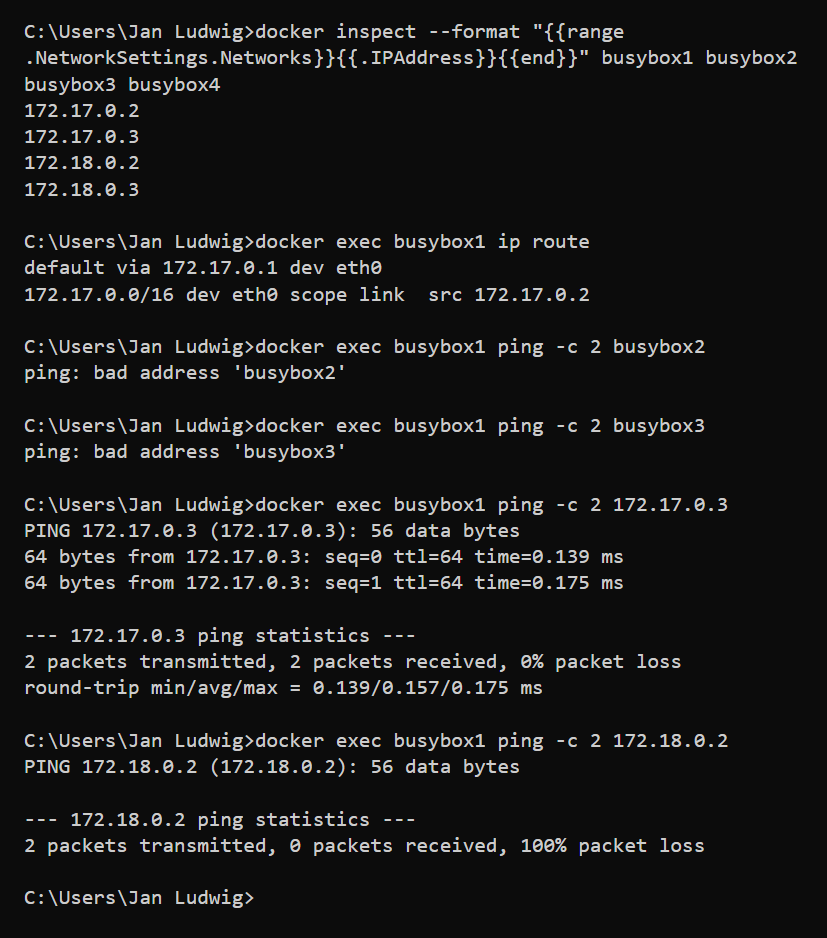
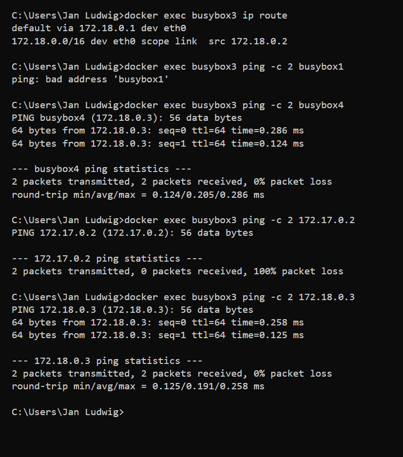

# KN03: Netzwerk / Sicherheit

## A) Eigenes Netzwerk (100%)

### Aufbau

4 busybox-Container: 2 im Default Bridge Netzwerk, 2 im user-defined Netzwerk `tbz`.

```bash
# Netzwerk erstellen mit IP-Range 172.18.0.0/16
docker network create --subnet=172.18.0.0/16 tbz

# Default Bridge Container
docker run -dit --name busybox1 busybox
docker run -dit --name busybox2 busybox

# tbz-Netzwerk Container
docker run -dit --name busybox3 --network tbz busybox
docker run -dit --name busybox4 --network tbz busybox
```

### 1. IP-Adressen

| Container | Netzwerk | IP-Adresse |
|-----------|----------|------------|
| busybox1 | default bridge | 172.17.0.2 |
| busybox2 | default bridge | 172.17.0.3 |
| busybox3 | tbz | 172.18.0.2 |
| busybox4 | tbz | 172.18.0.3 |

```bash
docker inspect --format "{{range .NetworkSettings.Networks}}{{.IPAddress}}{{end}}" busybox1
# 172.17.0.2
```

### 2. Tests von busybox1 (default bridge)



#### Default Gateway

```
$ ip route
default via 172.17.0.1 dev eth0
172.17.0.0/16 dev eth0 scope link  src 172.17.0.2
```

Default Gateway: **172.17.0.1** -- busybox2 hat den gleichen Gateway, da beide im selben default bridge Netzwerk sind.

#### ping busybox2 (by name)

```
$ ping -c 2 busybox2
ping: bad address 'busybox2'
```

Fehlgeschlagen -- im default bridge Netzwerk funktioniert DNS-Auflösung von Container-Namen **nicht**.

#### ping busybox3 (by name)

```
$ ping -c 2 busybox3
ping: bad address 'busybox3'
```

Fehlgeschlagen -- busybox3 ist in einem anderen Netzwerk und der Name kann nicht aufgelöst werden.

#### ping 172.17.0.3 (busybox2 by IP)

```
$ ping -c 2 172.17.0.3
PING 172.17.0.3 (172.17.0.3): 56 data bytes
64 bytes from 172.17.0.3: seq=0 ttl=64 time=0.133 ms
64 bytes from 172.17.0.3: seq=1 ttl=64 time=0.108 ms

--- 172.17.0.3 ping statistics ---
2 packets transmitted, 2 packets received, 0% packet loss
```

Erfolgreich -- busybox2 ist im selben Netzwerk und per IP erreichbar.

#### ping 172.18.0.2 (busybox3 by IP)

```
$ ping -c 2 172.18.0.2
PING 172.18.0.2 (172.18.0.2): 56 data bytes

--- 172.18.0.2 ping statistics ---
2 packets transmitted, 0 packets received, 100% packet loss
```

Fehlgeschlagen -- busybox3 ist in einem anderen Netzwerk (tbz). Die Netzwerke sind voneinander isoliert.

---

### 3. Tests von busybox3 (tbz network)



#### Default Gateway

```
$ ip route
default via 172.18.0.1 dev eth0
172.18.0.0/16 dev eth0 scope link  src 172.18.0.2
```

Default Gateway: **172.18.0.1** -- busybox4 hat den gleichen Gateway, da beide im selben tbz-Netzwerk sind.

#### ping busybox1 (by name)

```
$ ping -c 2 busybox1
ping: bad address 'busybox1'
```

Fehlgeschlagen -- busybox1 ist in einem anderen Netzwerk, Name kann nicht aufgelöst werden.

#### ping busybox4 (by name)

```
$ ping -c 2 busybox4
PING busybox4 (172.18.0.3): 56 data bytes
64 bytes from 172.18.0.3: seq=0 ttl=64 time=0.200 ms
64 bytes from 172.18.0.3: seq=1 ttl=64 time=0.099 ms

--- busybox4 ping statistics ---
2 packets transmitted, 2 packets received, 0% packet loss
```

Erfolgreich -- im user-defined Netzwerk (tbz) funktioniert die **DNS-Auflösung von Container-Namen**.

#### ping 172.17.0.2 (busybox1 by IP)

```
$ ping -c 2 172.17.0.2
PING 172.17.0.2 (172.17.0.2): 56 data bytes

--- 172.17.0.2 ping statistics ---
2 packets transmitted, 0 packets received, 100% packet loss
```

Fehlgeschlagen -- busybox1 ist im default bridge, nicht erreichbar aus dem tbz-Netzwerk.

#### ping 172.18.0.3 (busybox4 by IP)

```
$ ping -c 2 172.18.0.3
PING 172.18.0.3 (172.18.0.3): 56 data bytes
64 bytes from 172.18.0.3: seq=0 ttl=64 time=0.237 ms
64 bytes from 172.18.0.3: seq=1 ttl=64 time=0.108 ms

--- 172.18.0.3 ping statistics ---
2 packets transmitted, 2 packets received, 0% packet loss
```

Erfolgreich -- busybox4 ist im selben tbz-Netzwerk.

---

### Gemeinsamkeiten und Unterschiede

| | Default Bridge | User-defined (tbz) |
|---|---|---|
| Ping by IP (gleiches Netzwerk) | Funktioniert | Funktioniert |
| Ping by Name (gleiches Netzwerk) | Funktioniert **nicht** | Funktioniert |
| Ping by IP (anderes Netzwerk) | Funktioniert **nicht** | Funktioniert **nicht** |
| Ping by Name (anderes Netzwerk) | Funktioniert **nicht** | Funktioniert **nicht** |
| Gateway | 172.17.0.1 | 172.18.0.1 |

**Gemeinsamkeiten:**
- Container im selben Netzwerk können sich gegenseitig per IP erreichen
- Container in verschiedenen Netzwerken sind voneinander isoliert (kein Ping möglich, weder per Name noch per IP)
- Beide Netzwerke haben einen eigenen Gateway (Host)

**Unterschiede:**
- Im **default bridge** Netzwerk gibt es **keine DNS-Auflösung** von Container-Namen. Man kann nur per IP kommunizieren.
- Im **user-defined** Netzwerk (tbz) gibt es eine **eingebaute DNS-Auflösung**. Container können sich gegenseitig per Name erreichen.

**Schlussfolgerung:** User-defined Netzwerke bieten mehr Kontrolle und Komfort als das default bridge. Die automatische DNS-Auflösung macht die Kommunikation zwischen Containern einfacher und robuster, da sich IP-Adressen ändern können, aber Container-Namen stabil bleiben.

---

### Bezug zu KN02

- **In welchem Netzwerk befanden sich die beiden Container (kn02b-db und kn02b-web)?**
  Beide Container befanden sich im **default bridge** Netzwerk.

- **Wieso konnten die miteinander reden?**
  Wir haben den `--link kn02b-db` Parameter beim Starten des Web-Containers verwendet. Dieser Parameter erstellt einen DNS-Eintrag im Web-Container, der den Namen `kn02b-db` auf die IP-Adresse des DB-Containers auflöst. Ohne `--link` hätten die Container im default bridge nur per IP kommunizieren können, nicht per Name. Eine bessere Lösung wäre ein user-defined Netzwerk gewesen, wie wir es hier mit dem tbz-Netzwerk gesehen haben -- dort funktioniert die Namensauflösung automatisch ohne `--link`.
