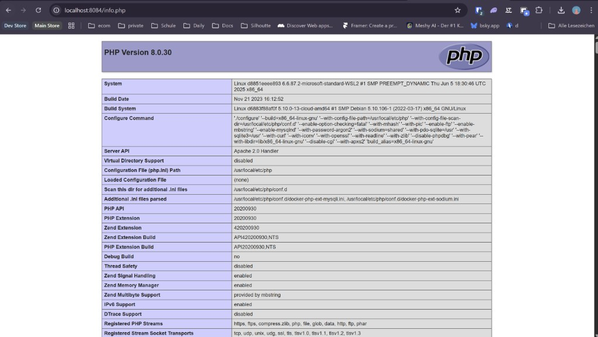
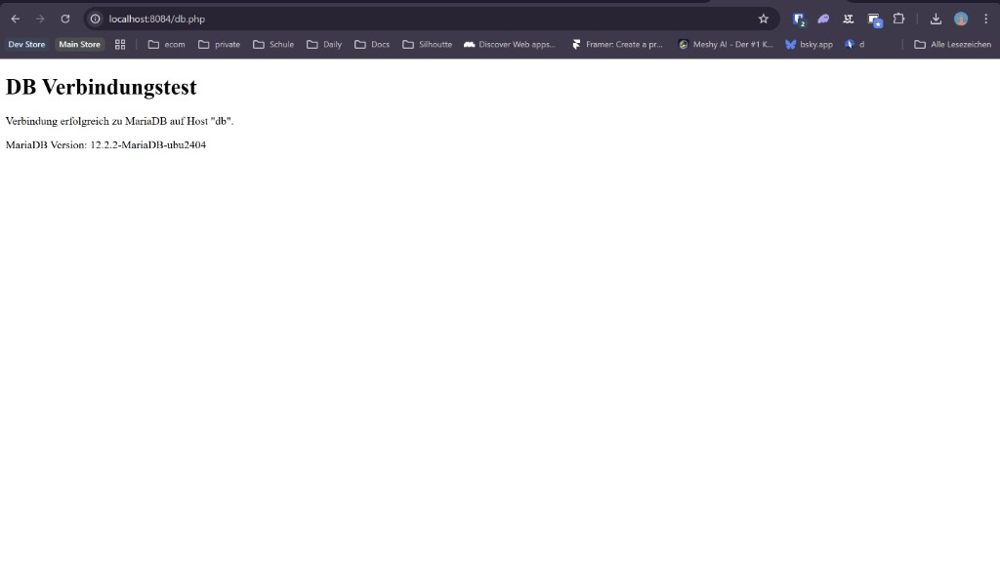
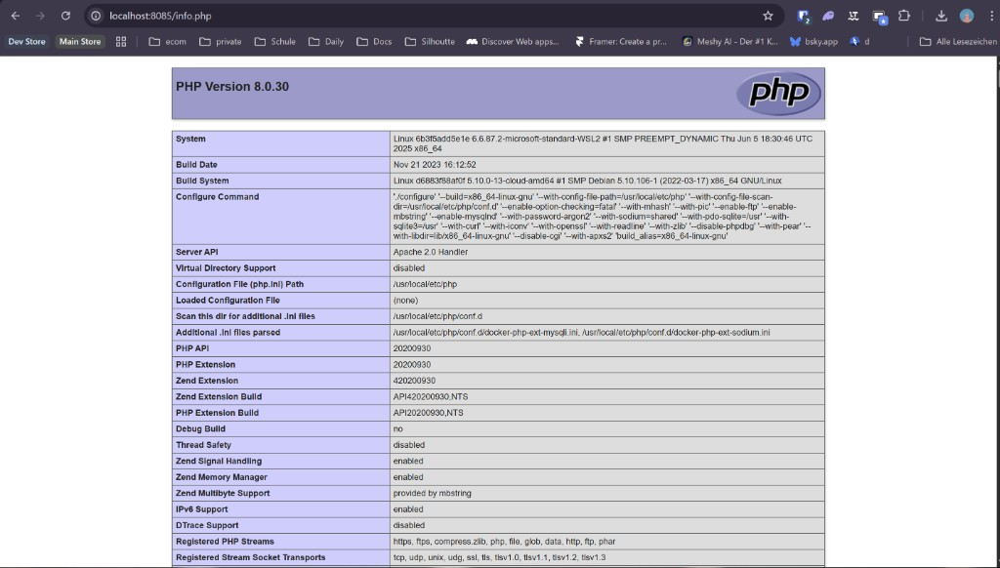
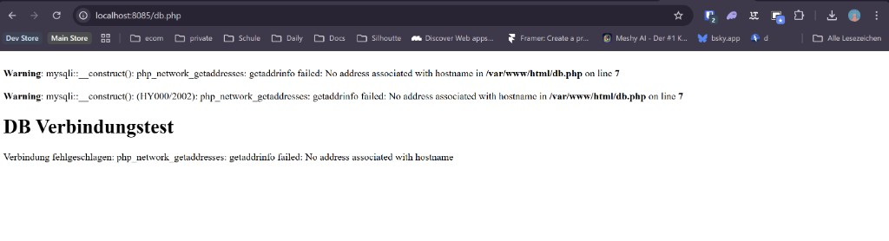

# KN04: Docker Compose

## A) Docker Compose: Lokal

## Teil a) Verwendung von Original Images

Ziel: MariaDB direkt in der Compose-Datei konfigurieren und den Webserver via Dockerfile bauen.

### Verwendete Dateien

- `KN04/A/docker-compose.yml`
- `KN04/A/web/Dockerfile`
- `KN04/A/web/info.php`
- `KN04/A/web/db.php`

### Verwendete Befehle

```bash
# In KN04/A
docker compose up -d --build
docker ps --filter "name=m347-kn04a"
docker compose down
```

### Ergebnis

- Containernamen:
  - `m347-kn04a-web`
  - `m347-kn04a-db`
- Netzwerk mit den geforderten Werten:
  - subnet: `172.10.0.0/16`
  - ip_range: `172.10.5.0/24`
  - gateway: `172.10.5.254`
- Test-URLs:
  - `http://localhost:8084/info.php`
  - `http://localhost:8084/db.php`

### Screenshots Teil a




---

## Teil b) Verwendung eigener Images

Ziel: Publizierte Images aus KN02 verwenden, ohne Dockerfile fuer den Webserver.

### Verwendete Datei

- `KN04/B/docker-compose.yml`

### Verwendete Befehle

```bash
# In KN04/B
docker compose up -d
docker ps --filter "name=m347-kn04b"
```

### Ergebnis

- Containernamen:
  - `m347-kn04b-web`
  - `m347-kn04b-db`
- Eigener IP-Range (anders als Teil a):
  - subnet: `172.11.0.0/16`
  - ip_range: `172.11.5.0/24`
  - gateway: `172.11.5.254`
- Test-URLs:
  - `http://localhost:8085/info.php`
  - `http://localhost:8085/db.php`

### Screenshots Teil b




Fehlerausgabe von `db.php` (erwartet in Teil b):

```text
Warning: mysqli::__construct(): php_network_getaddresses: getaddrinfo failed: No address associated with hostname in /var/www/html/db.php on line 7

Warning: mysqli::__construct(): (HY000/2002): php_network_getaddresses: getaddrinfo failed: No address associated with hostname in /var/www/html/db.php on line 7

DB Verbindungstest
Verbindung fehlgeschlagen: php_network_getaddresses: getaddrinfo failed: No address associated with hostname
```

---

## Warum tritt der Fehler in `db.php` auf?

Fehler:

`php_network_getaddresses: getaddrinfo failed: No address associated with hostname`

In `db.php` steht als DB-Host:

```php
$dbHost = 'db';
```

In Teil b heisst der Datenbank-Service in der Compose-Datei aber:

```yaml
services:
  mariadb:
```

Docker-Compose DNS verwendet standardmaessig den **Service-Namen** als Hostname.  
Darum kann `db` nicht aufgeloest werden und die Verbindung schlaegt fehl.

### Loesungen

1. Empfohlen: Service in Compose von `mariadb` auf `db` umbenennen.
2. Oder: In `db.php` den Hostnamen auf `mariadb` aendern.
3. Alternativ: Netzwerk-Alias `db` fuer den DB-Service setzen.

---

## Was macht `docker compose up` intern?

`docker compose up` ist ein Sammelbefehl. Er fuehrt je nach Projektzustand mehrere Schritte aus:

1. **Compose-Datei lesen und validieren**  
   (`docker-compose.yml` einlesen, Services/Netzwerke/Volumes aufloesen)
2. **Images vorbereiten**  
   - bei `build:`: Image bauen (entspricht `docker compose build`)  
   - bei `image:`: fehlende Images pullen (entspricht `docker compose pull`)
3. **Netzwerke und Volumes erstellen** (falls noch nicht vorhanden)
4. **Container erstellen** (entspricht logisch `docker create`)
5. **Container starten** (entspricht logisch `docker start`)
6. **Logs anbinden** (im Foreground ohne `-d`) oder detached starten (mit `-d`)

Kurz: `up` kombiniert typischerweise **build/pull + create + start** in einem Schritt.
