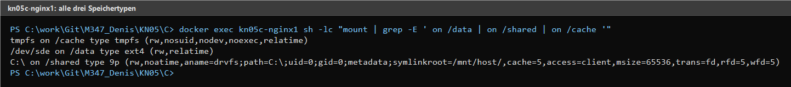
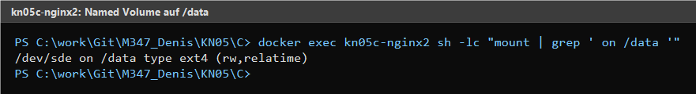

# KN05: Arbeit mit Speicher

Diese Abgabe deckt die drei Speicherarten von Docker ab:

- **A)** Bind Mount
- **B)** Named Volume
- **C)** Bind, Named Volume und tmpfs in einer `docker-compose.yml`

---

## A) Bind Mount

Ein Skript auf dem Host wird via Bind Mount in den Container gemappt. Eine
Aenderung des Skripts auf dem Host ist beim naechsten Container-Lauf sofort
sichtbar — typischer Anwendungsfall fuer Code-Live-Editing.

### Dateien

- `A/host_script.sh` — Skript auf dem Host
- `A/BEFEHLE_A.md` — vollstaendige Befehlsliste
- `A/screencast.mp4` — Screencast des Ablaufs (Aufnahme der Konsole)

### Ablauf

1. `host_script.sh` auf Version 1 setzen.
2. Container mit Bind Mount auf `KN05/A` starten — gibt **v1** aus.
3. `host_script.sh` auf Version 2 aendern.
4. Container erneut starten — gibt **v2** aus, ohne dass das Image neu gebaut wurde.

### Verwendete Befehle

```powershell
# 1) Erster Lauf: gibt v1 aus
docker run --name kn05a-bind-1 --rm `
  -v "C:/work/Git/M347_Denis/KN05/A:/shared" `
  nginx:latest bash /shared/host_script.sh

# 2) host_script.sh auf v2 aendern, dann zweiter Lauf: gibt v2 aus
docker run --name kn05a-bind-2 --rm `
  -v "C:/work/Git/M347_Denis/KN05/A:/shared" `
  nginx:latest bash /shared/host_script.sh
```

### Nachweis


---

## B) Named Volume

Zwei Container nutzen dasselbe Named Volume und schreiben gegenseitig in
dieselbe Datei `/data/shared.txt`. Beide sehen den gemeinsamen Stand.

### Dateien

- `B/BEFEHLE_B.md` — vollstaendige Befehlsliste
- `B/screencast.mp4` — Screencast des Ablaufs

### Ablauf

1. Named Volume `kn05b-shared` erstellen.
2. Zwei Container starten, beide haengen das Volume unter `/data` ein.
3. Container 1 schreibt eine Zeile in `/data/shared.txt`.
4. Container 2 liest die Zeile, schreibt eine eigene Antwort, liest erneut.
5. Container 1 liest erneut und ergaenzt eine weitere Zeile.
6. Container 2 liest den Endstand — beide sehen den vollstaendigen Inhalt.

### Verwendete Befehle (Auszug)

```powershell
docker volume create kn05b-shared
docker run -d --name kn05b-c1 -v kn05b-shared:/data nginx:latest
docker run -d --name kn05b-c2 -v kn05b-shared:/data nginx:latest

docker exec kn05b-c1 sh -lc "echo 'Nachricht von Container 1 - Denis' >> /data/shared.txt && cat /data/shared.txt"
docker exec kn05b-c2 sh -lc "cat /data/shared.txt && echo 'Antwort von Container 2 - Denis' >> /data/shared.txt && cat /data/shared.txt"
```

Vollstaendige Befehlsliste: siehe `B/BEFEHLE_B.md`.

---

## C) Docker Compose mit allen drei Speichertypen

Zwei `nginx`-Services, ein Top-Level Named Volume `kn05c_shared`. Der erste
Container haengt **alle drei** Speichertypen ein, der zweite Container nur
das Named Volume (per Short Syntax).

| Container     | Speichertyp                         | Pfad im Container | Syntax        |
|---------------|-------------------------------------|-------------------|---------------|
| `kn05c-nginx1`| Named Volume `kn05c_shared`         | `/data`           | Long Syntax   |
| `kn05c-nginx1`| Bind Mount `./bind_host`            | `/shared`         | Long Syntax   |
| `kn05c-nginx1`| tmpfs                               | `/cache`          | Long Syntax   |
| `kn05c-nginx2`| Named Volume `kn05c_shared`         | `/data`           | Short Syntax  |

### Dateien

- `C/docker-compose.yml`
- `C/bind_host/` — Inhalt fuer den Bind Mount

### Befehle

```powershell
# Im Ordner KN05/C
docker compose up -d
docker ps --filter "name=kn05c-nginx"

# Nachweise: mount-Auszuege aus beiden Containern
docker exec kn05c-nginx1 sh -lc "mount | grep -E ' on /data | on /shared | on /cache '"
docker exec kn05c-nginx2 sh -lc "mount | grep ' on /data '"

# Aufraeumen
docker compose down
docker volume rm kn05c_kn05c_shared
```

### Nachweis

`mount`-Auszug aus Container 1 (alle drei Speichertypen sichtbar):



`mount`-Auszug aus Container 2 (Named Volume auf `/data` sichtbar):


