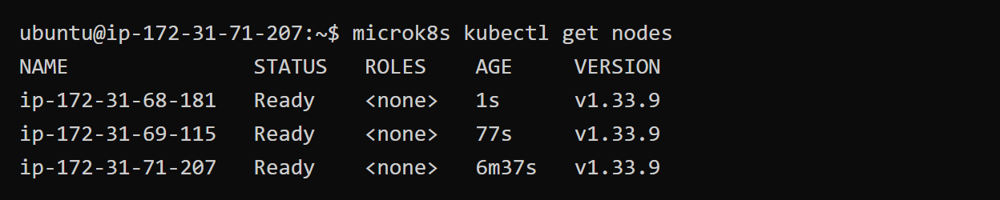
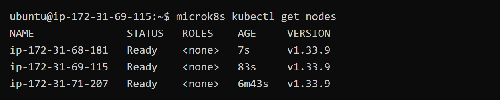
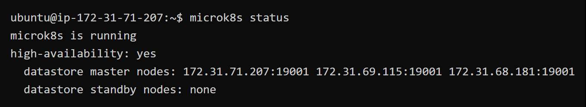
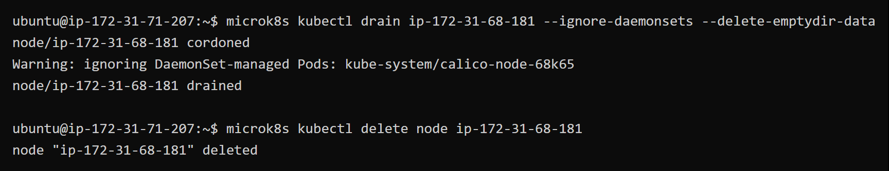
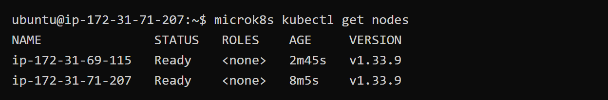
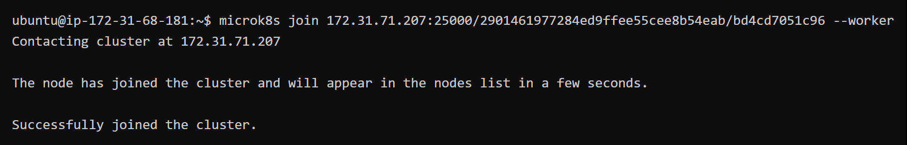
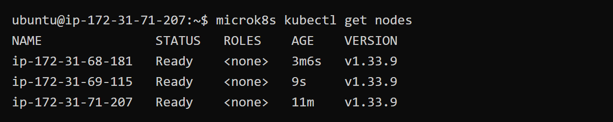
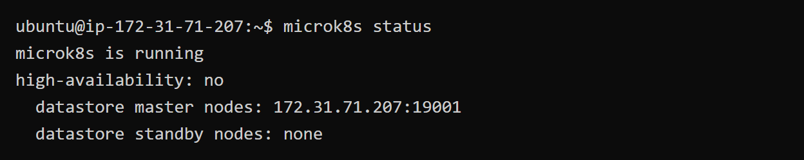
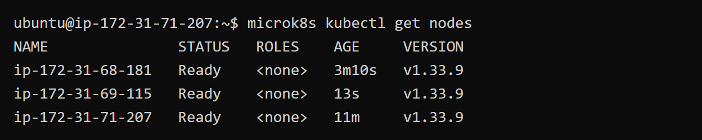
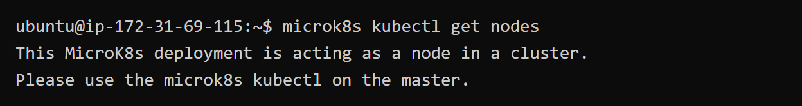

# KN06: Kubernetes I (MicroK8s / AWS)

Kurzüberblick zur Aufgabe: Installation eines MicroK8s-Clusters auf AWS (drei Nodes), danach Arbeit am laufenden Cluster (Status, Node entfernen/hinzufügen, Master/Worker). **Hinweis:** Diesen Cluster in **KN07** weiterverwenden.

---

## A) Installation — drei Nodes (50 %)

Nach der Installationsanleitung ([MikroK8s auf AWS](../Kubernetes/microk8s)) liegt ein Cluster mit **drei Nodes** vor.

Auf Node 1 (`ip-172-31-71-207`) wurde `microk8s kubectl get nodes` ausgeführt. Alle drei Nodes sind im Cluster und haben den Status `Ready`.

**Abgabe (A):** Screenshot von `microk8s kubectl get nodes`, der zeigt, dass alle drei Nodes hinzugefügt wurden.

---

## B) Cluster verstehen (50 %)

### B1: `get nodes` auf einem zweiten Node

Auf Node 2 (`ip-172-31-69-115`) ausgeführt — das Resultat entspricht A, da alle Nodes dieselbe Kubernetes-API abfragen.

### B2: `microk8s status` (vor „addons“)

Auf Node 1 ausgeführt (Zeilen vor „addons“):

**Erklärung:**

- **`microk8s is running`**: MicroK8s läuft auf diesem Node.
- **`high-availability: yes`**: Der Cluster ist im HA-Modus. Bei drei vollwertigen Nodes wird Dqlite (verteilte Datenbank) über alle Nodes repliziert. Fällt ein Node aus, können die verbleibenden zwei den Cluster weiterführen.
- **`datastore master nodes`**: Alle drei Nodes sind Dqlite-Master und speichern den Cluster-Zustand.

### B3: Node vom Cluster entfernen

Node 3 (`ip-172-31-68-181`) wurde mit `drain`, `delete node`, `leave` und `remove-node` entfernt:

Danach nur noch zwei Nodes im Cluster:

### B4: Node wieder als Worker hinzufügen

Beide entfernten Nodes wurden mit dem Flag **`--worker`** wieder hinzugefügt:

Ergebnis — **1 Master + 2 Worker**:

### B5: `microk8s status` nach Worker-Umbau

**Unterschied zu B2:**

- **`high-availability: no`** statt `yes` — Worker-Nodes tragen keinen Dqlite-/Control-Plane-Anteil.
- **Nur 1 datastore master** (`172.31.71.207`) statt 3 — Worker nehmen nicht am verteilten Datastore teil, daher gibt es keine HA-Replikation mehr.

### B6: `get nodes` auf Master und Worker

**Master (Node 1):**

**Worker (Node 2):**

**Erklärung:** Worker-Nodes können kein `kubectl` ausführen, da sie keinen API-Server betreiben. Das stimmt mit `microk8s status` überein: nur der Master führt die Control-Plane-Komponenten (API-Server, Scheduler, Controller-Manager) aus. Worker führen nur Workloads (Pods) aus.

**Abgaben (B):** Schritte und Screenshots wie oben; zusätzlich der folgende Abgabetext.

---

## Abgabetext: Unterschied `microk8s` und `microk8s kubectl` (eigene Worte)

- **`microk8s`** ist ein Verwaltungstool für die lokale MicroK8s-Installation (Snap-Paket). Es steuert den lokalen Dienst: `microk8s status` zeigt den Zustand der lokalen Installation, `microk8s add-node` generiert Join-Tokens, `microk8s leave` entfernt den Node aus dem Cluster. Diese Befehle betreffen die **lokale Node-Konfiguration**.

- **`microk8s kubectl`** ist das Standard-Kubernetes-CLI (`kubectl`), das gegen die **Kubernetes-API** des Clusters spricht. Es verwaltet Cluster-Ressourcen wie Pods, Nodes, Deployments und Services. Die Befehle wirken auf den gesamten Cluster, nicht nur auf den lokalen Node.

Kurz: `microk8s` = lokale Installation verwalten, `microk8s kubectl` = Cluster-Ressourcen über die API verwalten.

---

## Literatur / Grundlagen

- [TBZ: Kubernetes Architektur](../Kubernetes)
- [TBZ: MicroK8s](../Kubernetes/microk8s)
- [TBZ: Sicherheitsaspekte](../Kubernetes/Sicherheitsaspekte)
- Aufgabenstellung: [Aufgabenstellung.md](Aufgabenstellung.md)
